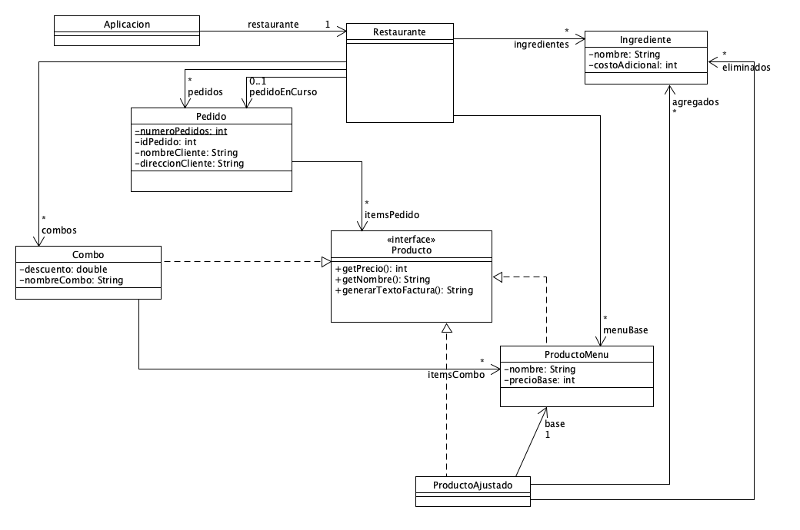

# Objetivo general
El objetivo de este taller es aprender a implementar en Java un modelo de clases dado, reconocer los diferentes componentes que podrían aparecer en un modelo de clases y practicar la implementación de algoritmos básicos en Java

# Objetivos especificos

Durante el desarrollo de este taller se buscará el desarrollo de las siguientes habilidades:
1. Implementar en Java un modelo de clases expresado como un diagrama de clases de UML, incluyendo 
atributos de los principales tipos básicos y métodos con funcionalidades básicas.
2. Entender el significado de la cardinalidad (multiplicity) en las asociaciones entre clases y ser capaz de 
implementar diferentes tipos de asociaciones usando relaciones directas, listas (ArrayList) y mapas (Maps)
3. Entender el significado de null en Java, saber verificar si una referencia tiene valor null y entender los 
problemas relacionados con invocar métodos sobre referencias con valor null.
4. Conocer el método equals.
5. Utilizar con habilidad el ambiente de programación del curso y ser capaz de buscar recursos externos que les 
permitan resolver problemas técnicos puntuales

Más información en el siguiente [documento.](docs/hamburguesas.pdf)

# Diagrama de clases resumido (UML)

# Desarrollo del taller

## [Parte 1: Implementar el modelo de clases de la lógica](docs/implement.md)