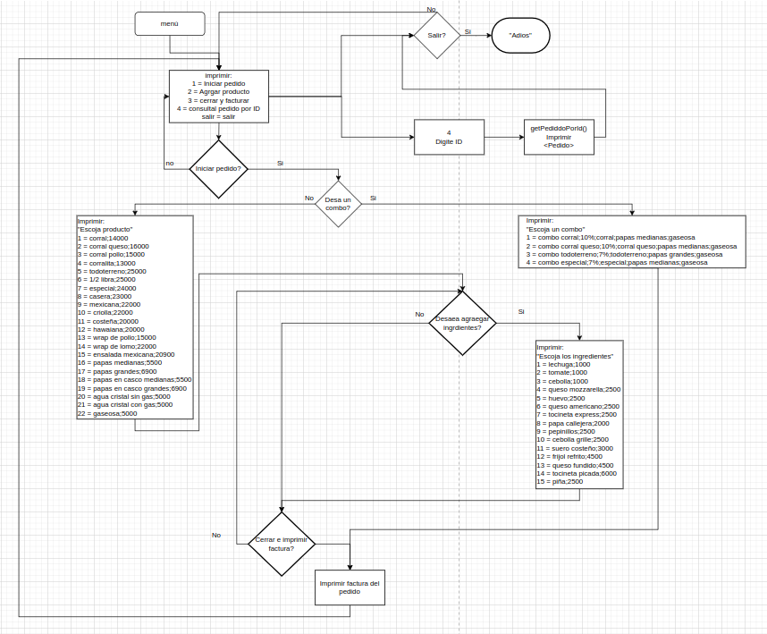
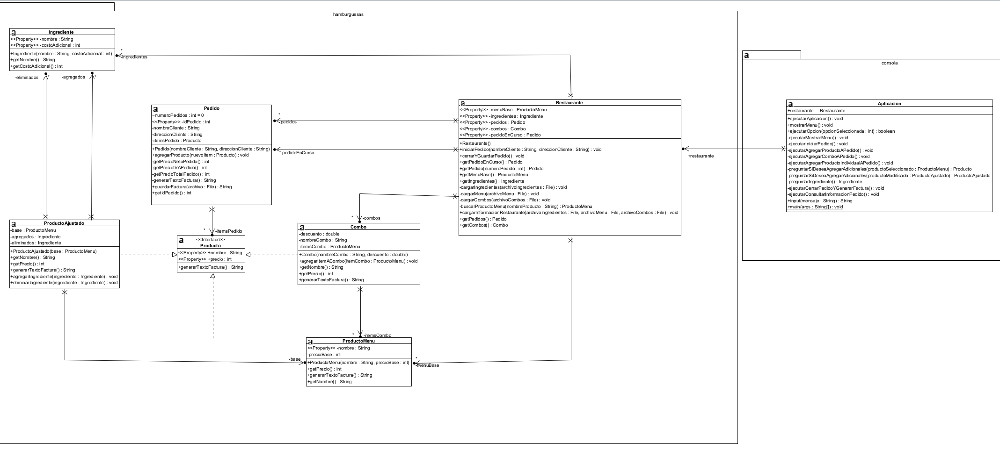

# Parte 2: Implementar una consola para la aplicación

El modelo UML propone una clase Aplicación con unos pocos métodos básicos. Usted debe decidir qué otras 
clases y métodos quiere incluir en la consola de la aplicación. 
1. Construya un mapa de las opciones que va a ofrecer su aplicación: puede utilizar el mecanismo que quiera 
para explicar cuáles van a ser los menús, cómo van a estar organizados y conectados entre ellos, cómo va 
a seleccionar las opciones el usuario, etc.
2. Construya un diagrama UML donde aparezcan todas las clases y métodos que usted va a implementar.
3. Implemente la consola para la aplicación
4. Ejecute su aplicación y compruebe que funciona correctamente

## **Puede encontrar el código fuente de la versión original de la aplicación [aquí.](https://github.com/DPOO202202-AM/taller-2/releases/tag/v2.4)**
## Diagrama de flujo de las opciones

## Diagrama UML de las clases y métodos

# [&#8592;](../README.md)
